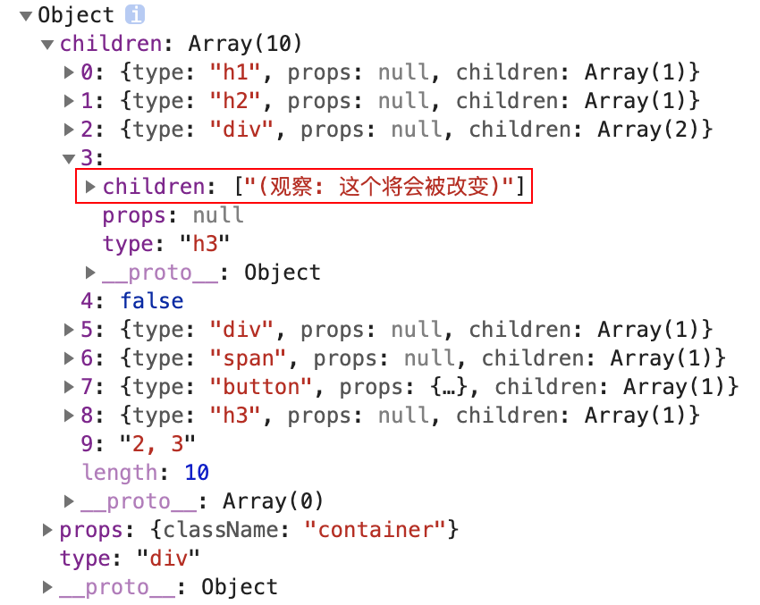

# 5. 创建 Virtual DOM

在 React 代码执行前，JSX 会被 Babel 转换为 React.createElement 方法的调用，在调用 createElement 方法时会传入元素的类型，元素的属性，以及元素的子元素，createElement 方法的返回值为构建好的 Virtual DOM 对象。

```javascript
{
  type: "div",
  props: null,
  children: [{type: "text", props: {textContent: "Hello"}}]
}
```

```javascript
/**
 * 创建 Virtual DOM
 * @param {string} type 类型
 * @param {object | null} props 属性
 * @param  {createElement[]} children 子元素
 * @return {object} Virtual DOM
 */
function createElement(type, props, ...children) {
  return {
    type,
    props,
    children,
  };
}
```

从 createElement 方法的第三个参数开始就都是子元素了，在定义 createElement 方法时，通过 `...children` 将所有的子元素放置到 children 数组中。

```javascript
const virtualDOM = (
  <div className="container">
    <h1>你好 Tiny React</h1>
    <h2>(编码必杀技)</h2>
    <div>
      嵌套1 <div>嵌套 1.1</div>
    </div>
    <h3>(观察: 这个将会被改变)</h3>
    {2 == 1 && <div>如果2和1相等渲染当前内容</div>}
    {2 == 2 && <div>2</div>}
    <span>这是一段内容</span>
    <button onClick={() => alert("你好")}>点击我</button>
    <h3>这个将会被删除</h3>
    2, 3
  </div>
);
console.log(virtualDOM);
```

通过以上代码测试，发现返回的 Virtual DOM 存在一些问题，第一个问题是文本节点被直接放入到了数组中



而我们期望是文本节点应该是这样的

```javascript
children: [
  {
    type: "text",
    props: {
      textContent: "React is great",
    },
  },
];
```

通过以下代码对 Virtual DOM 进行改造，重新构建 Virtual DOM。

```javascript
// 将原有 children 拷贝一份 不要在原有数组上进行操作
const childElements = [].concat(...children).map((child) => {
  // 判断 child 是否是对象类型
  if (child instanceof Object) {
    // 如果是 什么都不需要做 直接返回即可
    return child;
  } else {
    // 如果不是对象就是文本 手动调用 createElement 方法将文本转换为 Virtual DOM
    return createElement("text", { textContent: child });
  }
});
return {
  type,
  props,
  children: childElements,
};
```


通过观察返回的 Virtual DOM，文本节点已经被转化成了对象类型的 Virtual DOM，但是布尔值也被当做文本节点被转化了，在 JSX 中，如果 Virtual DOM 被转化为了布尔值或者 null，是不应该被更新到真实 DOM 中的，所以接下来要做的事情就是清除 Virtual DOM 中的布尔值和 null。

```javascript
// 由于 map 方法无法从数据中刨除元素, 所以此处将 map 方法更改为 reduce 方法
const childElements = [].concat(...children).reduce((result, child) => {
  // 判断子元素类型 刨除 null true false
  if (child != null && child != false && child != true) {
    if (child instanceof Object) {
      result.push(child);
    } else {
      result.push(createElement("text", { textContent: child }));
    }
  }
  // 将需要保留的 Virtual DOM 放入 result 数组
  return result;
}, []);
```

在 React 组件中，可以通过 props.children 获取子元素，所以还需要将子元素存储在 props 对象中。

```javascript
return {
  type,
  props: Object.assign({ children: childElements }, props),
  children: childElements,
};
```
