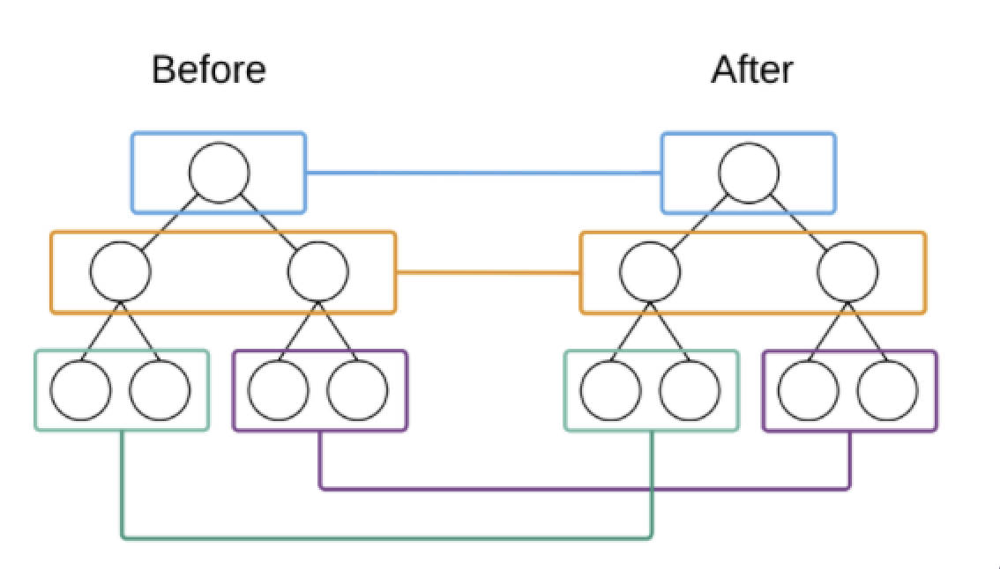

# 8. 渲染组件

## 8.1 函数组件

在渲染组件之前首先要明确的是，组件的 Virtual DOM 类型值为函数，函数组件和类组件都是这样的。

```javascript
// 原始组件
const Heart = () => <span>&hearts;</span>;
```

```javascript
<Heart />
```

```javascript
// 组件的 Virtual DOM
{
  type: f function() {},
  props: {}
  children: []
}
```

在渲染组件时，要先将 Component 与 Native Element 区分开，如果是 Native Element 可以直接开始渲染，如果是组件，特别处理。

```javascript
// mountElement.js
export default function mountElement(virtualDOM, container) {
  // 无论是类组件还是函数组件 其实本质上都是函数
  // 如果 Virtual DOM 的 type 属性值为函数 就说明当前这个 Virtual DOM 为组件
  if (isFunction(virtualDOM)) {
    // 如果是组件 调用 mountComponent 方法进行组件渲染
    mountComponent(virtualDOM, container);
  } else {
    mountNativeElement(virtualDOM, container);
  }
}

// Virtual DOM 是否为函数类型
export function isFunction(virtualDOM) {
  return virtualDOM && typeof virtualDOM.type === "function";
}
```

在 mountComponent 方法中再进行函数组件和类型的区分，然后再分别进行处理。

```javascript
// mountComponent.js
import mountNativeElement from "./mountNativeElement";

export default function mountComponent(virtualDOM, container) {
  // 存放组件调用后返回的 Virtual DOM 的容器
  let nextVirtualDOM = null;
  // 区分函数型组件和类组件
  if (isFunctionalComponent(virtualDOM)) {
    // 函数组件 调用 buildFunctionalComponent 方法处理函数组件
    nextVirtualDOM = buildFunctionalComponent(virtualDOM);
  } else {
    // 类组件
  }
  // 判断得到的 Virtual Dom 是否是组件
  if (isFunction(nextVirtualDOM)) {
    // 如果是组件 继续调用 mountComponent 解剖组件
    mountComponent(nextVirtualDOM, container);
  } else {
    // 如果是 Navtive Element 就去渲染
    mountNativeElement(nextVirtualDOM, container);
  }
}

// Virtual DOM 是否为函数型组件
// 条件有两个: 1. Virtual DOM 的 type 属性值为函数 2. 函数的原型对象中不能有render方法
// 只有类组件的原型对象中有render方法
export function isFunctionalComponent(virtualDOM) {
  const type = virtualDOM && virtualDOM.type;
  return (
    type && isFunction(virtualDOM) && !(type.prototype && type.prototype.render)
  );
}

// 函数组件处理
function buildFunctionalComponent(virtualDOM) {
  // 通过 Virtual DOM 中的 type 属性获取到组件函数并调用
  // 调用组件函数时将 Virtual DOM 对象中的 props 属性传递给组件函数 这样在组件中就可以通过 props 属性获取数据了
  // 组件返回要渲染的 Virtual DOM
  return virtualDOM && virtualDOM.type(virtualDOM.props || {});
}
```

## 8.2 类组件

类组件本身也是 Virtual DOM，可以通过 Virtual DOM 中的 type 属性值确定当前要渲染的组件是类组件还是函数组件。

在确定当前要渲染的组件为类组件以后，需要实例化类组件得到类组件实例对象，通过类组件实例对象调用类组件中的 render 方法，获取组件要渲染的 Virtual DOM。

类组件需要继承 Component 父类，子类需要通过 super 方法将自身的 props 属性传递给 Component 父类，父类会将 props 属性挂载为父类属性，子类继承了父类，自己本身也就自然拥有 props 属性了。这样做的好处是当 props 发生更新后，父类可以根据更新后的 props 帮助子类更新视图。

假设以下代码就是我们要渲染的类组件：

```javascript
class Alert extends TinyReact.Component {
  constructor(props) {
    // 将 props 传递给父类 子类继承父类的 props 子类自然就有 props 数据了
    // 否则 props 仅仅是 constructor 函数的参数而已
    // 将 props 传递给父类的好处是 当 props 发生更改时 父类可以帮助更新 props 更新组件视图
    super(props);
    this.state = {
      title: "default title",
    };
  }
  render() {
    return (
      <div>
        <h2>{this.state.title}</h2>
        <p>{this.props.message}</p>
      </div>
    );
  }
}

TinyReact.render(<Alert message="Hello React" />, root);
```

```javascript
// Component.js 父类 Component 实现
export default class Component {
  constructor(props) {
    this.props = props;
  }
}
```

在 mountComponent 方法中通过调用 buildStatefulComponent 方法得到类组件要渲染的 Virtual DOM

```javascript
// mountComponent.js
export default function mountComponent(virtualDOM, container) {
  let nextVirtualDOM = null;
  // 区分函数型组件和类组件
  if (isFunctionalComponent(virtualDOM)) {
    // 函数组件
    nextVirtualDOM = buildFunctionalComponent(virtualDOM);
  } else {
    // 类组件
    nextVirtualDOM = buildStatefulComponent(virtualDOM);
  }
  // 判断得到的 Virtual Dom 是否是组件
  if (isFunction(nextVirtualDOM)) {
    mountComponent(nextVirtualDOM, container);
  } else {
    mountNativeElement(nextVirtualDOM, container);
  }
}

// 处理类组件
function buildStatefulComponent(virtualDOM) {
  // 实例化类组件 得到类组件实例对象 并将 props 属性传递进类组件
  const component = new virtualDOM.type(virtualDOM.props);
  // 调用类组件中的render方法得到要渲染的 Virtual DOM
  const nextVirtualDOM = component.render();
  // 返回要渲染的 Virtual DOM
  return nextVirtualDOM;
}
```

### 9. Virtual DOM 比对

在进行 Virtual DOM 比对时，需要用到更新后的 Virtual DOM 和更新前的 Virtual DOM，更新后的 Virtual DOM 目前我们可以通过 render 方法进行传递，现在的问题是更新前的 Virtual DOM 要如何获取呢？

对于更新前的 Virtual DOM，对应的其实就是已经在页面中显示的真实 DOM 对象。既然是这样，那么我们在创建真实 DOM 对象时，就可以将 Virtual DOM 添加到真实 DOM 对象的属性中。在进行 Virtual DOM 对比之前，就可以通过真实 DOM 对象获取其对应的 Virtual DOM 对象了，其实就是通过 render 方法的第三个参数获取的，container.firstChild。

在创建真实 DOM 对象时为其添加对应的 Virtual DOM 对象

```javascript
// mountElement.js
import mountElement from "./mountElement";

export default function mountNativeElement(virtualDOM, container) {
  // 将 Virtual DOM 挂载到真实 DOM 对象的属性中 方便在对比时获取其 Virtual DOM
  newElement._virtualDOM = virtualDOM;
}
```


